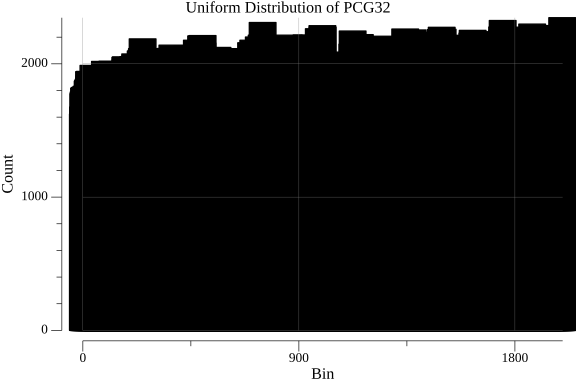

# pcg

Go implementation of the PCG (Permuted Congruential Generator) pseudo-random number generator algorithm, specifically PCG32 and PCG64.

## Overview

PCG is a family of pseudo-random number generators designed to be fast, statistically high-quality, reliable, and portable. The PCG algorithm combines a linear congruential generator (LCG) with a permutation function to produce highly random and uniformly distributed numbers.

The key components of the PCG algorithm are:

1. LCG: The LCG is used to generate a sequence of pseudo-random numbers. it is defined by the recurrence relation:

```math
state(n+1) = \{state(n) * multiplier + increment \} \ mod \ 2^{64}
```

The LCG has a period of $2^{64}$

2. Permutation Function: The permutation function is applied to the output of the LCG to improve the statistical quality of the generated numbers. it helps in eliminating any regularities or patterns present in the LCG sequence. The permutation function used in PCG is based on `xorshift` and rotation operations.

The combination of the LCG and the permutation function results in a fast and high-quality pseudo-random number generator.

## PCG32

PCG32 is a 32-bit random number generator.

To create a new PCG32 generator with the default state and sequence values:

```go
rng := pcg.NewPCG32()
```

To seed the PCG32 generator with specific state and sequence values:

```go
rng := pcg.NewPCG32().Seed(state, sequence)
```

Also, you can create random number within a specific range `[0, x)`:

```go
randomNum := rng.Uint32n(x)
```

## PCG64

PCG64 is a 64-bit random number generator.

### Serialization

The PCG64 generator state can be serialized to and deserialized from a binary format using the following methods:

```go
rng := pcg.NewPCG64WithSeed(seed1, seed2)

// Serialize the PCG64 state to a byte slice
serializedState, err := rng.MarshalBinaryPCG64()

// Deserialize the PCG64 state from a byte slice
err := rng.UnmarshalBinaryPCG64(serializedState)
if err != nil {
    return err
}
```

There is also an unsafe version of serialization that doesn't allocate any memory and is about 30 times faster than the safe version:

> ⚠️ caution: The unsafe version should be used with caution as it relies on unsafe memory operations.

```go
unsafeRes, err := rng.MarshalBinaryPCG64Unsafe()
if err != nil {
    return err
}
```

## PCG32 Uniform Distribution
The PCG32 pseudorandom number generator is designed to produce uniformly distributed numbers. To verify this property, we conducted a statistical test by generating a large number of samples and counting the occurrences of each value within fixed bins.



In this test, we generated 1,000,000 pseudorandom numbers using PCG32 and divided the range of possible values into 10 equal-sized bins. We then counted the number of occurrences of each value within each bin.
As evident from the graph, the counts for each bin are approximately equal, indicating that the generated values are uniformly distributed. The height of each bar represents the count of values falling within that bin.

The code used to generate this distribution graph can be found in the `plot/main.go` file.

## Benchmarks

### PCG32 vs Math/rand

```bench
BenchmarkPCG32-8           435930150         2.798 ns/op       0 B/op       0 allocs/op
BenchmarkMathRand-8        201459418         5.908 ns/op       0 B/op       0 allocs/op
BenchmarkPCG32_InRange-8   443862901         2.725 ns/op       0 B/op       0 allocs/op
Benchmark_MathRanIntn-8    152259916         7.863 ns/op       0 B/op       0 allocs/op
```

### Marshaling

```bench
BenchmarkPCG_MarshalBinary-8          74071786        16.06 ns/op      24 B/op       1 allocs/op
BenchmarkPCG_MarshalBinary_Unsafe-8   1000000000      0.5331 ns/op      0 B/op       0 allocs/op
```

---

## References

- <https://www.pcg-random.org/>
- <https://www.pcg-random.org/posts/128-bit-mcg-passes-practrand.html>
